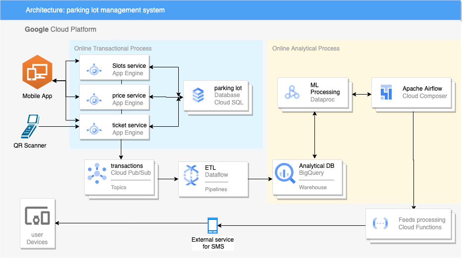
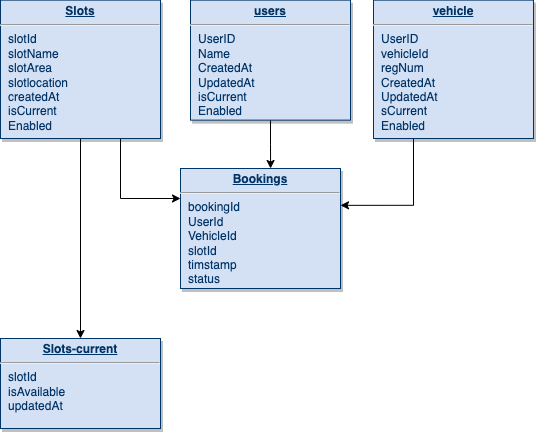

# Introduction
This High level design below provides the cloud component and its underlying
functionality. Also, it answers all the questions requested in the document.
I have used Google cloud managed services to design this. Services used are:

* App engine
* cloud SQL
* Pub/Sub - message queue manager
* Dataflow - Apache Beam ETL for streaming payloads
* Bigquery
* cloud composer - Managed Airflow
* Dataproc - Managed hadoop cluster for spark payloads
* cloud functions - for adhoc processing of data

# Architecture

# components
* **Mobile app** : User interface, source of data generation for all the
parking requests, slot availability, booking and payments.
* **slots service** :  service will interact with transactional DB 
and will provide the real time slots availability and slots consumption.
* **price service** : this service internally consumes the slot 
to provide the pricing data while booking.
* **ticket service** : this service will consume slot service and 
price service for check-in and check-out procedures.
* **parking lot Database** : this will host the transactional Data for 
the parking lot slots, prices, booking and user base etc.
* **transactions Pub/Sub** : whenever there is generation of data at any of the
services it will be dropped to pub/sub topics and pub/sub will own the message until
its processing.
* **ETL-Dataflow** : we will use streaming service provided by Dataflow by writing apache 
beam pipelines to consume the messages from pub/sub, transform it and push it warehouse.
* **Analytical DB - Bigquery** : we are using Bigquery to store and warehouse
data which can be used for analytical payloads.
* **ML processing-Dataproc** : we have utilised Dataproc hadoop clusters to run
pre-trained predictive models for prediction and forecasting needs. this will consume data
from bigquery and store the processed data back in bigquery 
* **feeds processing - cloud functions** : we have used cloud function which is on 
demand managed environment to run compiled codes written in any famous language for
ad-hoc operational needs. here we are processing the feed which is required to be sent to
external system which will be sending SMS's to the end users.
* **Airflow- composer** : managed airflow instance from google. Here we have used this to orchesterate 
between dataproc cluster and cloud function for the SMS feed. it provides isolated task execution 
and monitoring at single place.
* **external vendor** : we can't send and schedule SMS directly to the users. Therefore we
can use external services like braze, salesforce for SMS and email notifications.

# Data model for transactional Database
Below mentioned Model is self explainatory and addresses the problem statement.

# Deployment and development
Since we are using cloud services we can easily deploy and automate the apps 
using cloud build. we can use **Terraform** for infra deployments and **cloud Build**
to provide isolate deployment environment. Assuming we are using github or cloud repository
for every push to main we will set up multiple triggers(watching specific path changes) and YAML files for deployment 
automation of our resources. these YAML files will define the steps of deployment which may 
include unit testing and integration testing. this is also explained in the challenge task 2 comments.
A developer can create a feature branch from main branch and do the required changes.
once done, developer will raise the pull request for his branch to be merged in to main.
we will define **CODEOWNERS** in local github config and define the owners for their
respective repo directory. Github will trigger the notification for the respective code owner
to review the Pull request and merge it into the main. Once merged in to the main. Cloud build 
trigger will pick the respective YAML and run the deployment pipeline.

